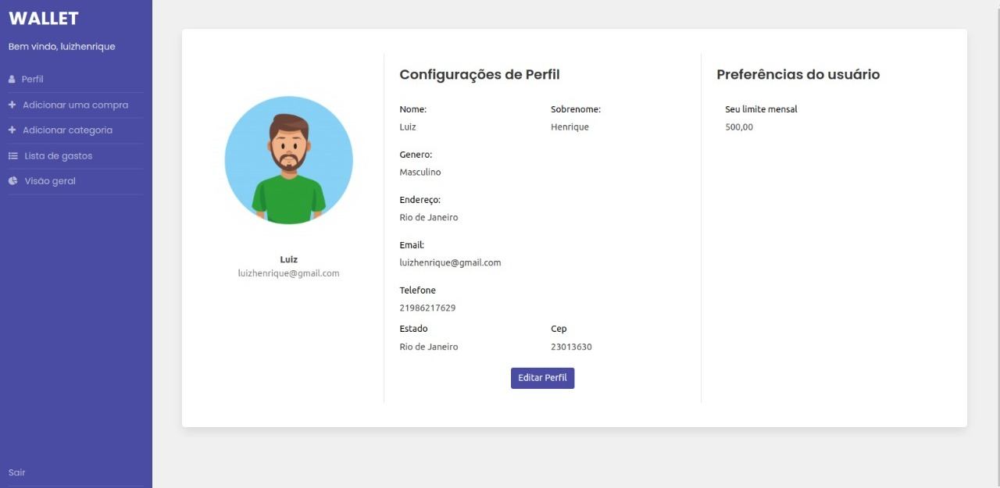
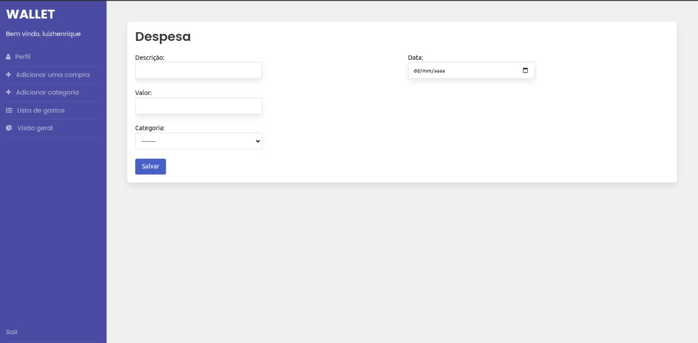
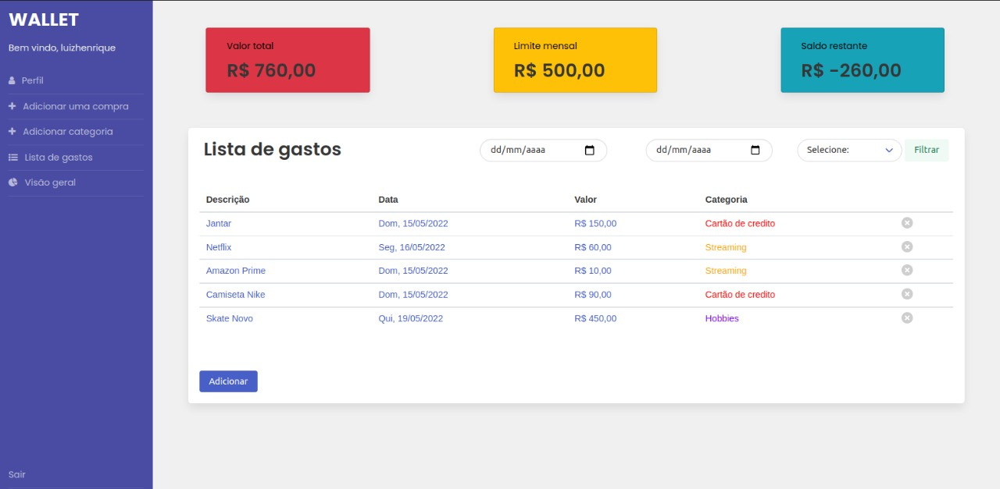
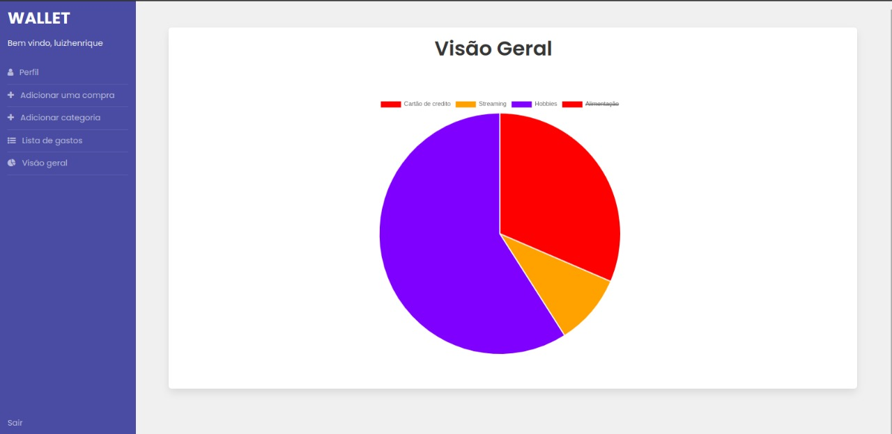

<h1> Wallet - Controle Financeiro </h1>

## Descrição do projeto 

Projeto de estudo em Django  
Site de controle financeiro, onde o usuário organizar e ter um overview sobre seus gastos mensais. 

## Funcionalidades

- [x] Criar/Editar perfil
- [x] Cadastrar gastos 
- [x] Criar/editar categorias
- [x] Definir limite mensal
- [x] Ver o valor total gasto 
- [x] Saldo restante
- [x] Grafico de compras 
- [x] Adicionar cor nas categorias
- [x] Filtrar por data 
- [x] Filtrar por categoria 

## Screenshots
<h3 style="width:500px"> 
 

 
 
 
 
</h3>

###

## Ferramentas utilizadas

  

###

## Instalação

 - Instalar o docker e docker-compose
 - pip install -r requirements.txt

 

